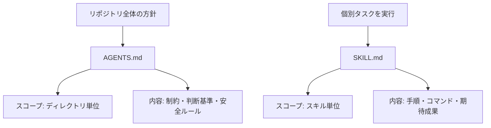

# dev-skills

開発で使っている、比較的汎用的なSKILLをまとめて育てていくリポジトリです。

## SKILL is 何？

SKILL.mdは、コーディングエージェントに「この流れで進めてね」と伝えるための手順書です。

コーディングエージェントの活用が広がり始めたごく初期には、各エージェントごとに形式がばらばらでみんな手探りで運用していました。最近は `AGENTS.md + SKILL.md` という形に寄ってきていて、だいぶ扱いやすくなってきた印象です。

### 参考リンク

- [Agent Skills公式](https://agentskills.io/home)
- [AGENTS.md公式](https://agents.md/)

## AGENTS.mdとSKILL.mdの違い

ざっくり言うと、`AGENTS.md` は「このディレクトリで守るルール」、`SKILL.md` は「特定タスクの進め方」です。



| 項目         | AGENTS.md                            | SKILL.md                    |
| ------------ | ------------------------------------ | --------------------------- |
| 主な役割     | ガードレールを定義                   | 実行手順を定義              |
| 読まれる場面 | そのディレクトリ配下で作業するとき   | そのスキルを呼び出したとき  |
| 置き場所     | リポジトリルートや各サブディレクトリ | 各スキルディレクトリ        |
| 例           | 「秘匿情報を含めない」               | 「Issueを作成してPRを作る」 |

普段の開発はClaude Codeをメインに、Codexをサブで使っています。

Claude CodeではSKILLをカスタムコマンドのように読み込ませる使い方もできますが、このリポジトリのSKILL.mdは、特定エージェントに依存しないプレーンな形で書くようにしています。

## Skills

| スキル                                          | 概要                                        |
| ----------------------------------------------- | ------------------------------------------- |
| [clean-docs](./clean-docs/SKILL.md)             | `.claude/docs` のタスクドキュメント整理     |
| [collect-feedback](./collect-feedback/SKILL.md) | 変更内容に対するフィードバック収集と整理    |
| [codex-review](./codex-review/SKILL.md)         | codex CLIによるコードレビュー               |
| [commit](./commit/SKILL.md)                     | gitコミット（段階的コミット、fixup、amend） |
| [gh-edit](./gh-edit/SKILL.md)                   | GitHub PR/Issueの作成・更新                 |
| [link-skills](./link-skills/SKILL.md)           | skillsディレクトリのシンボリックリンク作成  |

## Setup

エージェントによっては、AGENTS.mdやSKILL.mdをリポジトリに置いただけでは、デフォルトで読んでくれないことがあります。

たとえばClaude Codeの場合は、`AGENTS.md` ではなく `CLAUDE.md` を参照し、スキルは `.claude/skills` 配下に置く必要があります。こういうときは、シンボリックリンクでつなぐのが手軽です。

`~/.claude/skills` にこのリポジトリへのシンボリックリンクを作成するコマンド:

```bash
ln -s /path/to/dev-skills ~/.claude/skills
```
