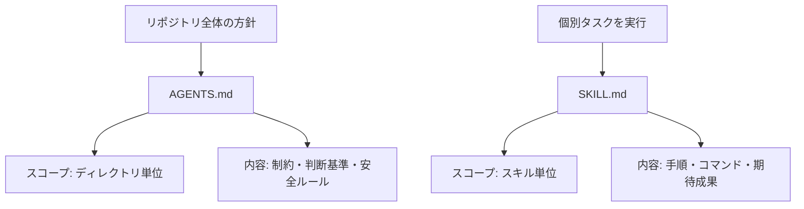

# dev-skills

開発で使っている、比較的汎用的なSKILLをまとめて育てていくリポジトリです。

## SKILL is 何？

SKILL.mdは、コーディングエージェントに「この流れで進めてね」と伝えるための手順書です。

コーディングエージェントの活用が広がり始めたごく初期には、各エージェントごとに形式がばらばらでみんな手探りで運用していました。最近は `AGENTS.md + SKILL.md` という形に寄ってきていて、だいぶ扱いやすくなってきた印象です。

### 参考リンク

- [Agent Skills公式](https://agentskills.io/home)
- [AGENTS.md公式](https://agents.md/)

## AGENTS.mdとSKILL.mdの違い

ざっくり言うと、`AGENTS.md` は「このディレクトリで守るルール」、`SKILL.md` は「特定タスクの進め方」です。



| 項目         | AGENTS.md                            | SKILL.md                    |
| ------------ | ------------------------------------ | --------------------------- |
| 主な役割     | ガードレールを定義                   | 実行手順を定義              |
| 読まれる場面 | そのディレクトリ配下で作業するとき   | そのスキルを呼び出したとき  |
| 置き場所     | リポジトリルートや各サブディレクトリ | 各スキルディレクトリ        |
| 例           | 「秘匿情報を含めない」               | 「Issueを作成してPRを作る」 |

普段の開発はClaude Codeをメインに、Codexをサブで使っています。

Claude CodeではSKILLをカスタムコマンドのように読み込ませる使い方もできますが、このリポジトリのSKILL.mdは、特定エージェントに依存しないプレーンな形で書くようにしています。

## Skills

| スキル                                          | 概要                                        |
| ----------------------------------------------- | ------------------------------------------- |
| [backup-branch](./backup-branch/SKILL.md)       | autosquash や大きな履歴編集前の退避ブランチ作成 |
| [catch-up](./catch-up/SKILL.md)                 | main 取り込みと rebase 後の確認             |
| [check](./check/SKILL.md)                       | lint・build・test・review の一連実行        |
| [clean-docs](./clean-docs/SKILL.md)             | `.claude/docs` のタスクドキュメント整理     |
| [collect-feedback](./collect-feedback/SKILL.md) | 変更内容に対するフィードバック収集と整理    |
| [codex-review](./codex-review/SKILL.md)         | codex CLIによるコードレビュー               |
| [commit](./commit/SKILL.md)                     | gitコミット（段階的コミット、fixup、amend） |
| [doc-check](./doc-check/SKILL.md)               | ドキュメント整合性の確認                    |
| [doc-sync](./doc-sync/SKILL.md)                 | ドキュメント整合性の修正                    |
| [fixup](./fixup/SKILL.md)                       | 既存コミットへの fixup 追加                 |
| [gh-edit](./gh-edit/SKILL.md)                   | GitHub PR/Issueの作成・更新                 |
| [gh-read](./gh-read/SKILL.md)                   | GitHub Issue/PR の参照と要約                |
| [link-skills](./link-skills/SKILL.md)           | Codex / Claude 向けスキルリンク作成         |
| [mark](./mark/SKILL.md)                         | チェック済み状態のタグ設置                  |
| [monthly-report](./monthly-report/SKILL.md)     | GitHub 活動データからの月次報告作成         |
| [pr-progress](./pr-progress/SKILL.md)           | PR 進捗コメントの整形・更新                 |
| [push](./push/SKILL.md)                         | push 前確認と push 実行                     |
| [reply-review](./reply-review/SKILL.md)         | レビューコメントへの返信支援                |
| [respond](./respond/SKILL.md)                   | 指摘対応から返信までのワークフロー          |
| [ship](./ship/SKILL.md)                         | check から PR 更新までの出荷フロー          |
| [start-dev](./start-dev/SKILL.md)               | 作業開始時のブランチ準備と情報収集          |
| [tanaoroshi](./tanaoroshi/SKILL.md)             | 複数リポジトリの Issue/PR 棚卸し            |
| [watch-ci](./watch-ci/SKILL.md)                 | CI 状態の監視と失敗時の確認                 |

補助スキルとして [daily-tagging](./.skill/daily-tagging/SKILL.md) も管理しています。

## Setup

エージェントによっては、AGENTS.mdやSKILL.mdをリポジトリに置いただけでは、デフォルトで読んでくれないことがあります。

たとえば Claude Code では `CLAUDE.md` と `.claude/skills`、Codex では `AGENTS.md` と `~/.codex/skills` を使います。こういうときはリンクでつなぐのが手軽です。

### Windows で Codex を使う場合

`~/.codex/skills` 配下に、各スキルディレクトリへのジャンクションを作成します。

例:

```bash
mklink /J %USERPROFILE%\.codex\skills\commit C:\path\to\dev-skills\commit
```

### macOS / Linux で Claude Code を使う場合

リポジトリ全体を `.claude/skills` へリンクする運用ができます。

例:

```bash
ln -s /path/to/dev-skills ~/.claude/skills
```
